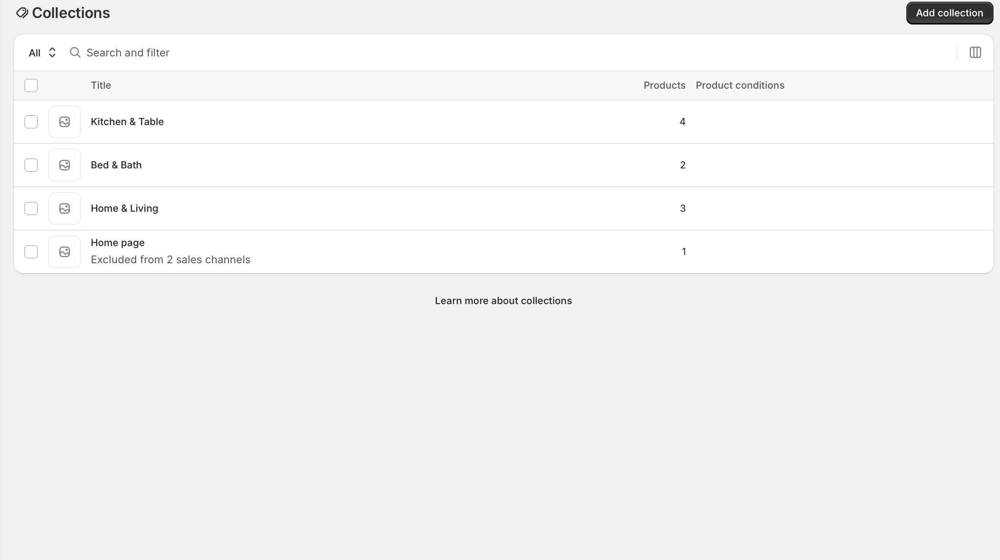
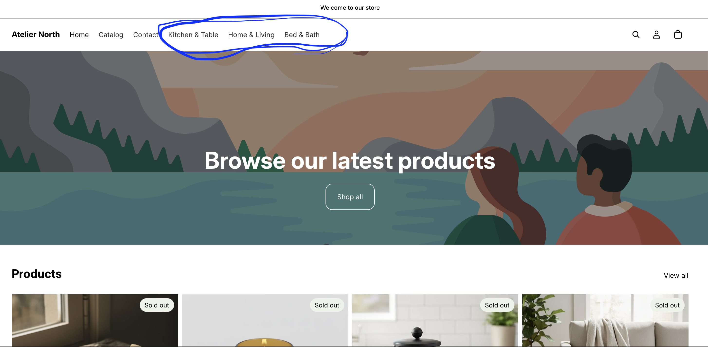

## Collections and Navigation

**Created Collections:** 1. Kitchen & Table 2. Home & Living 3. Bed & Bath

**Main Navigation Menu Structure:** \* Home \* Catalog \* Contact \* Kitchen & Table \* Home & Living \* Bed & Bath

------------------------------------------------------------------------

## Screenshots

### Collections in the Shopify Admin

*(Showing the backend setup of the three distinct product categories)*

### Collection Pages on the Storefront

*(Showing the customer-facing view of the categorized products)*

------------------------------------------------------------------------

## Merchandising Logic

The products were organized into these specific collections to create a visually cohesive and seasonally relevant shopping experience. By grouping items based on their primary use case and seasonal timing, customers who arrive looking for a specific wardrobe update can immediately find relevant cross-sells within that same category. This logical grouping mimics how a customer naturally builds an outfit or shops in a physical retail store, which helps to streamline the browsing process and ultimately increases the likelihood of multi-item purchases and a higher average order value.

## Customer Experience

The navigation structure is designed to reduce friction and minimize the number of clicks required for a customer to reach their desired products. By placing the three primary collections directly in the main header menu—rather than burying them under a single, generic "Shop" dropdown—the store immediately communicates its specific offerings to visitors the moment they land on the homepage. This clear, top-level visibility prevents cognitive overload, caters to high-intent shoppers who know exactly what they want, and allows casual browsers to seamlessly jump between major sections of the store without getting lost or frustrated.

## CPP Farm Store Application

If the Cal Poly Pomona (CPP) Farm Store were to optimize its online product categories, it would benefit immensely from organizing its unique inventory into intuitive, distinct collections such as "Fresh Produce," "Nursery & Plants," "CPP Branded Apparel," and "Student-Made Goods." Because the Farm Store serves a highly diverse customer base—ranging from local residents buying weekly groceries to alumni purchasing university merchandise—this categorization would allow different shopper personas to navigate directly to their specific areas of interest. Furthermore, highlighting a "Student-Made" or "Cal Poly Crafted" collection front-and-center in the navigation would emphasize the university's core "learn by doing" philosophy, serving as both an effective merchandising strategy and a strong brand differentiator.

## Appendix

Github Repository: https://github.com/brianvuong1/retail-marketing

Published Report: https://brianvuong1.github.io/retail-marketing/collections-navigations.html