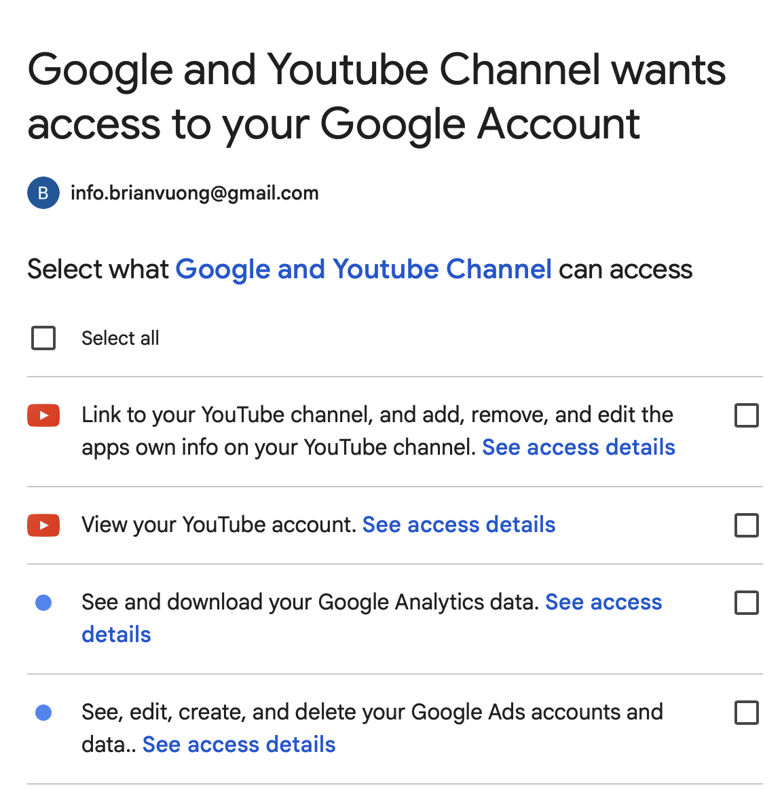

## Introduction

This report documents the process of attempting to connect a Shopify practice store to Google Merchant Center. The practice store is configured as an e-commerce storefront selling seasonal apparel and accessories, set up to test multi-channel selling and product data synchronization.

------------------------------------------------------------------------

## Connection Attempt Evidence

To connect the store, I installed the **Google & YouTube sales channel** within the Shopify admin and initiated the setup process. However, the connection process was halted. The main issue encountered was being unable to connect to a YouTube account because a YouTube channel does not currently exist for the associated Google account.

*(Screenshot showing the Google & YouTube sales channel setup screen and the missing YouTube channel error)* 

------------------------------------------------------------------------

## Product Sync and Listing Evidence

Because of the setup barrier encountered during the initial account linking phase, a complete product sync was not achieved.

- **Did you reach a product sync screen?** I was able to access the initial product overview tabs within the Google channel, but the actual sync was blocked from completing.
- **Sync Status:** The Shopify products failed to sync to Google Merchant Center due to the setup process being halted.
- **Missing/Incomplete Information:** Upon reviewing standard product data requirements, several products in the store were missing Global Trade Item Numbers (GTINs) and Manufacturer Part Numbers (MPNs). Some products also lacked specific Google product categories and shipping weights.
- **Flagged/Blocked Products:** Products could not be approved or were flagged as needing additional information, primarily because the merchant account connection itself was incomplete.
- **Data Needed for Improvement:** Before the store could successfully use Google Merchant Center, every product would need standard barcodes (GTINs) or be properly categorized as a custom product. Furthermore, detailed product descriptions, high-resolution images with white backgrounds, and accurate shipping weights must be added.

------------------------------------------------------------------------

## Setup Barriers and Warnings

The primary issue encountered during the connection attempt was a **Google account setup barrier specifically related to YouTube**. The Shopify Google & YouTube sales channel requires the connected Google account to have an active YouTube channel to complete the full integration suite. Because the Google account linked to the store does not have an established YouTube channel, the setup process generated an error and prevented the Merchant Center linking from proceeding.

Additionally, standard Merchant Center setups often flag missing business information. A store must have a verified, claimed domain, and perfectly matching contact information on the Shopify store and the Google account to pass Google's strict trust and safety policies.

------------------------------------------------------------------------

## Fixes Needed

To realistically use Google Merchant Center and resolve the errors encountered, the following fixes are required:

1.  **Create a YouTube Channel:** The immediate roadblock must be resolved by logging into YouTube with the store's associated Google account and formally creating a YouTube channel, which allows the Shopify app to complete its connection.
2.  **Domain Verification:** The store's domain must be properly verified and claimed within the Google Merchant Center dashboard using an HTML tag or DNS record.
3.  **Business Information:** The physical address, customer service email, and phone number must be explicitly listed on the Shopify storefront and perfectly match the details in Google Merchant Center.
4.  **Legal Pages:** Google requires distinct, easily accessible links in the footer for a Refund/Return Policy, Terms of Service, and a complete Checkout process. The practice store needs these pages fully fleshed out.
5.  **Product Data:** Update the inventory to include GTINs for all commercial items, or formally declare custom items as lacking identifiers using the `identifier_exists` attribute set to 'false'.

------------------------------------------------------------------------

## CPP Farm Store Reflection

Connecting a Shopify store to Google Merchant Center is a rigorous process that demands meticulous preparation, and the Cal Poly Pomona (CPP) Farm Store would need to address several key areas before launching Google Shopping Ads. Based on my experience, the biggest hurdle is ensuring high-quality, standardized product data that aligns with Google's strict taxonomy, as well as meeting all account prerequisites like having linked, active social and video channels.

For the Farm Store, this means differentiating between commercial products and agricultural goods. Items like CPP-branded apparel, packaged snacks, or bottled honey will need proper Global Trade Item Numbers (GTINs) to avoid being flagged or blocked by Google. Conversely, fresh produce, nursery plants, and student-made goods typically lack barcodes. The Farm Store team must ensure these are explicitly marked as custom or non-barcoded items (`identifier_exists = false`) within Shopify to prevent mass sync failures.

Furthermore, Google Merchant Center enforces strict trust and safety policies. Before connecting, the Farm Store must ensure its website infrastructure is completely transparent. This requires having clearly visible, legally compliant Refund, Return, and Shipping policies accessible from the footer of every page. Given that the Farm Store sells perishable goods, their return policy must specifically and clearly address how agricultural products are handled compared to non-perishable merchandise.

Store credibility also hinges on accurate business information and an active digital footprint. Just as my setup required a YouTube channel, the Farm Store should ensure all its official Google and YouTube accounts are created, active, and properly linked to their domain. Finally, high-quality, un-watermarked product photography with solid white backgrounds is heavily favored by Google Shopping. By proactively resolving these product data, account, policy, and media requirements, the CPP Farm Store can ensure a smooth integration with Google and run highly effective Shopping Ads.