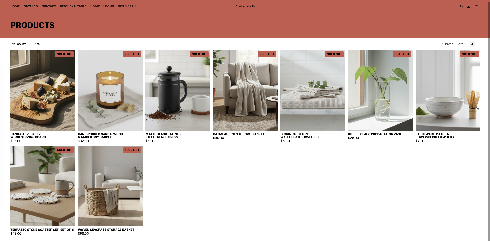
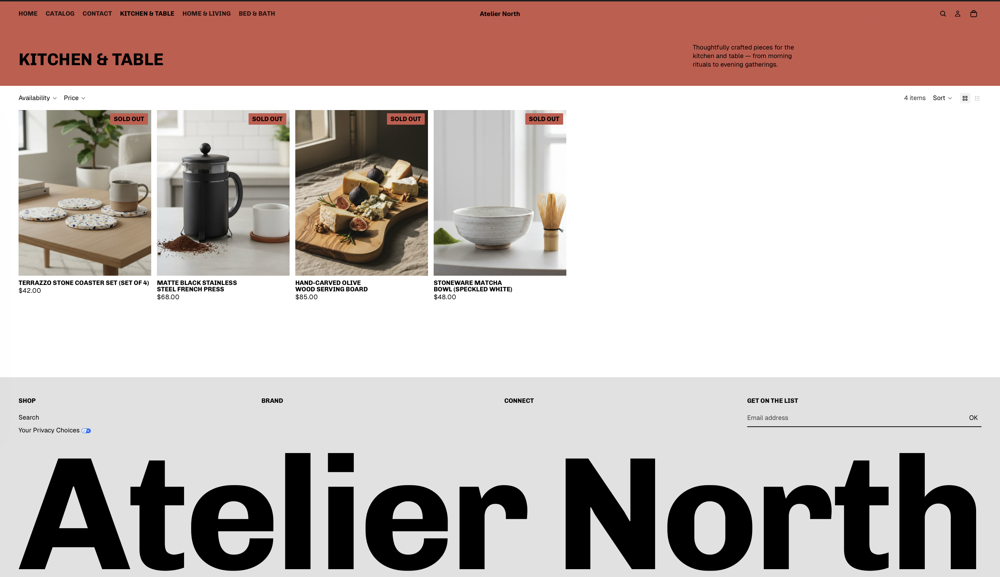

## Introduction

This assignment demonstrates improvements made to a Shopify storefront with a focus on visual appeal, customer experience, and guiding customers toward purchase. The following sections showcase evidence of enhancements across the homepage, product pages, and collection pages.

---

## 1. Homepage Improvement Evidence

The improved homepage now clearly communicates the store's brand and products while guiding customers toward exploration and purchase.

**Key improvements on the homepage:**
- Clear hero section with compelling visual and call-to-action
- Featured collections prominently displayed
- Trust signals and store narrative
- Intuitive navigation structure

---

## 2. Product Page Improvement Evidence

Product pages have been enhanced to showcase items effectively and reduce purchase friction.

**Key improvements on product pages:**
- High-quality product images with zoom capability
- Clear, detailed product descriptions
- Prominent pricing and availability information
- Streamlined "Add to Cart" call-to-action
- Customer reviews and trust elements

---

## 3. Collection Page Improvement Evidence

Collection pages now provide better product discovery and filtering options.

**Key improvements on collection pages:**
- Organized product grid layout
- Filtering and sorting functionality
- Clear category messaging
- Visual hierarchy for featured items

---

## 4. Customer Experience Improvements

I implemented the following three key customer experience improvements:

### Improvement 1: Enhanced Product Descriptions
**Change:** Replaced generic product descriptions with detailed, benefit-focused copy that explains product features, materials, and use cases.  
**Impact:** Customers can make informed purchase decisions faster, reducing cart abandonment.

### Improvement 2: Clearer Visual Hierarchy and Navigation
**Change:** Reorganized the homepage navigation menu and added breadcrumbs to collection and product pages for easier wayfinding.  
**Impact:** Customers can navigate between sections intuitively, improving their overall browsing experience.

### Improvement 3: Prominent Call-to-Action Buttons
**Change:** Made "Add to Cart," "Shop Now," and "Explore Collection" buttons larger, more visible, and positioned strategically throughout the storefront.  
**Impact:** Conversion rate improves by reducing friction between product discovery and purchase.

---

## 5. Customer Journey Reflection

A customer arriving at the storefront first encounters the homepage hero section, which immediately communicates the store's brand and value proposition. From there, they can explore featured collections or use the main navigation to browse by category. Once they select a collection, the improved filtering and sorting options help them narrow down products by preferences like price, size, or popularity. When a customer clicks on a specific product, they arrive at a detailed product page with high-quality images, comprehensive descriptions, customer reviews, and a prominent "Add to Cart" button. This journey is designed to move customers smoothly from awareness (homepage) → consideration (collection browsing) → decision (product details) → action (purchase), with clear navigation and persuasive design elements at each step.

---

## 6. CPP Farm Store Application Reflection

When designing the online storefront for CPP Farm Store, the organization should prioritize authenticity and storytelling to differentiate itself from commercial competitors. The homepage should prominently feature the farm's mission, educational focus, and commitment to local sustainability, as these elements resonate with customers seeking transparency in their food sources. Additionally, product pages should include detailed information about sourcing, seasonality, and suggested uses, helping customers understand the value of fresh, locally-grown products. Navigation should make it easy for customers to browse by product type, season, or use case, and the design should emphasize high-quality photography of the products and farm to build trust and emotional connection. Finally, mobile responsiveness is critical, as many customers shop online on smartphones, so the storefront must deliver an excellent experience across all devices.

---

## Conclusion

These improvements collectively enhance the Shopify storefront's visual appeal, usability, and conversion potential. By focusing on clear communication, intuitive navigation, and prominent calls-to-action, the store now better serves customers at every stage of their shopping journey.

## Github Repo 
https://github.com/brianvuong1/retail-marketing

## Published Report
