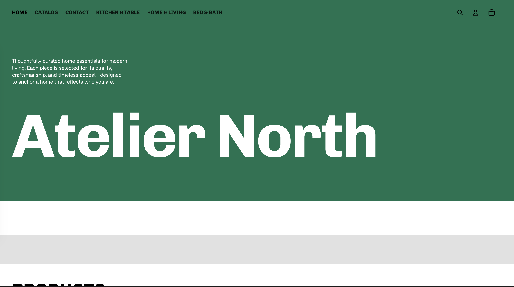
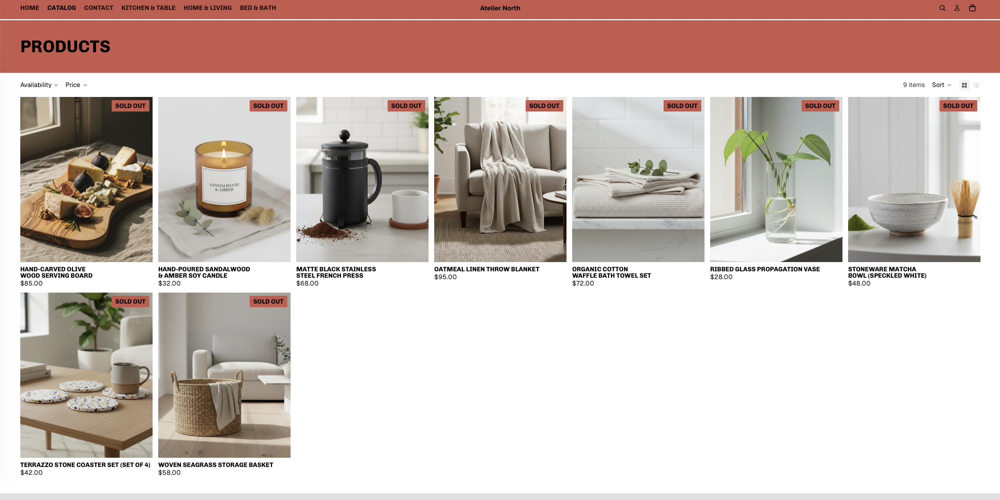
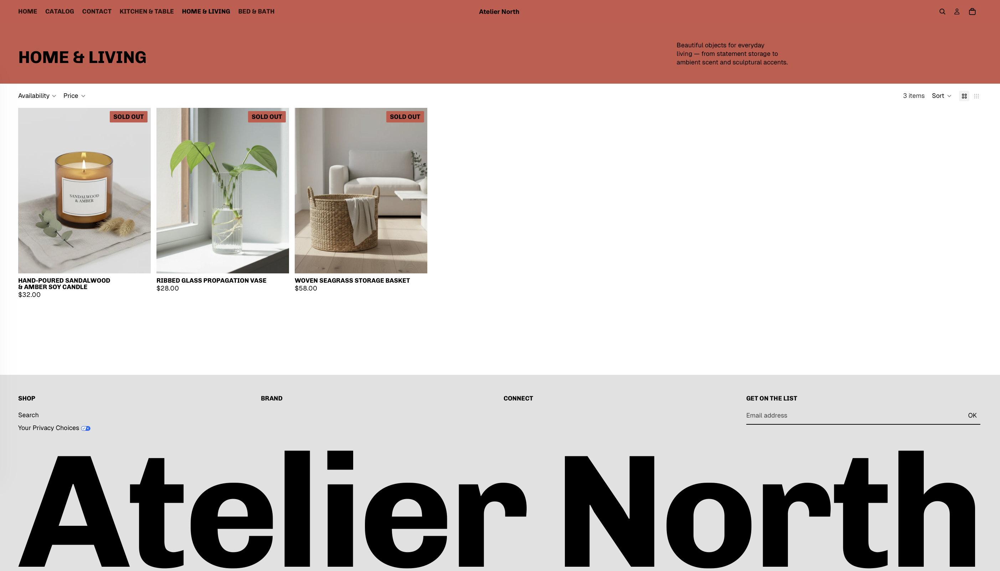
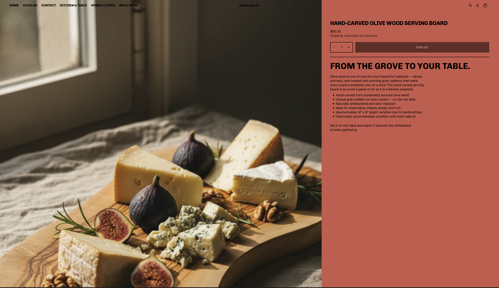
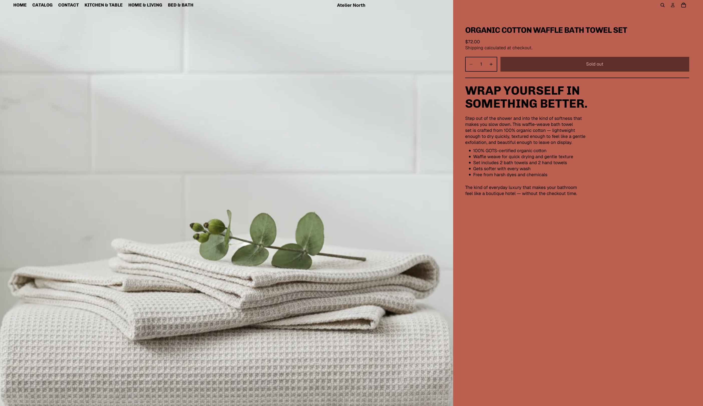
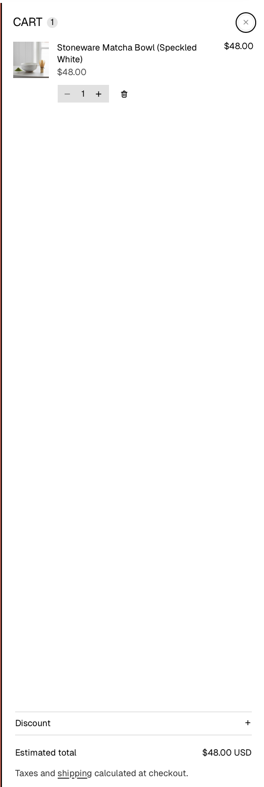
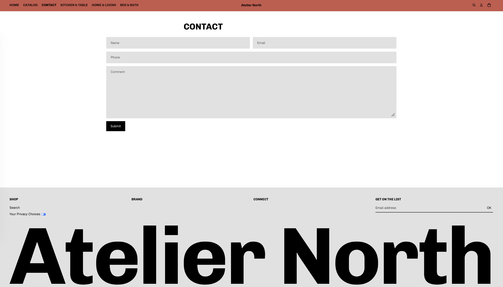
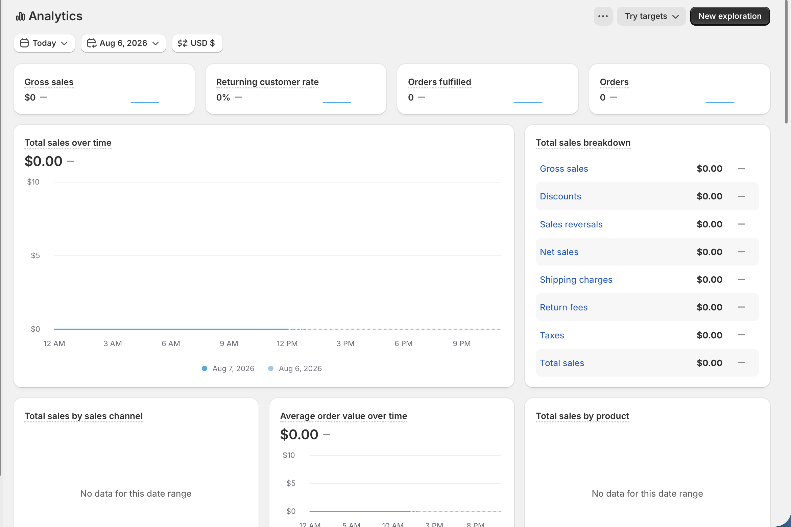

## Overview

This report documents a customer-journey walkthrough of my pretend Shopify
store, **Atelier North** ([10b3ys-0m.myshopify.com](https://10b3ys-0m.myshopify.com)),
along with a review of available Shopify analytics. The goal was to test the
shopping experience as a customer would encounter it — from homepage to
checkout preview — and to identify strengths and gaps ahead of the final
project submission in Week 11.

## Customer Journey Test

I tested the path a customer would take through the store: **Homepage →
Collection page → Product page → Cart → Checkout preview.**

### Stage 1: Homepage

The homepage opens with a full-width green hero banner, the "Atelier North"
wordmark, a short brand description ("Thoughtfully curated home essentials
for modern living..."), and a top navigation bar with Home, Catalog, Contact,
and three category links (Kitchen & Table, Home & Living, Bed & Bath).

### Stage 2: Collection / Catalog page

From the homepage nav, I moved to the full Catalog page, which lists all 9
products in a grid with filtering (Availability, Price) and sorting controls.
Every product on this page is tagged **SOLD OUT**.

I also tested a filtered collection page (Home & Living), which correctly
narrowed the grid to 3 relevant items — but all three were also sold out.

### Stage 3: Product page

Clicking into individual products (Hand-Carved Olive Wood Serving Board and
Organic Cotton Waffle Bath Towel Set) loads a full product detail page: large
lifestyle photography, product title, price, a quantity selector, and a
description block with bullet-point specs. On both pages the purchase button
is disabled and reads **"Sold out."**

### Stage 4: Cart

Despite the storefront listing every product as sold out, I was able to
successfully add the **Stoneware Matcha Bowl (Speckled White)** to the cart.
The cart drawer opened correctly, showing the item, quantity controls, a
delete option, a discount code field, and an estimated total ($48.00 USD),
with a note that taxes and shipping are calculated at checkout.

### Stage 5: Checkout preview

Because the store is a development/password-protected store, I was not able
to proceed past the cart into a full checkout preview. The cart correctly
displays subtotal, discount, and an estimated total, which is the extent of
the checkout flow available for testing in this environment.

### Contact page

I also tested the Contact page, which loads a standard form (Name, Email,
Phone, Comment) with a Submit button, plus a footer with shop links and a
newsletter signup.

## Store Strengths

1. **Strong, consistent visual identity.** The green/terracotta color
   palette, bold serif-adjacent headline type, and full-bleed lifestyle
   photography give the store a cohesive, premium "curated home goods" feel
   across every page.
2. **Well-written, benefit-driven product copy.** Product pages go beyond a
   spec list — each one has a short narrative header ("From the Grove to
   Your Table," "Wrap Yourself in Something Better") that sells the
   experience of the product, not just its features.
3. **Clear navigation and filtering.** The top nav consistently exposes all
   three product categories, and collection pages include working
   Availability, Price, and Sort controls, making the catalog easy to browse.

## Areas for Improvement

1. **Every product is marked "Sold out," which blocks the core shopping
   flow.** All 9 catalog items — across both the full catalog and the
   filtered Home & Living collection — display a disabled "Sold out" button.
   This prevents a normal customer from ever reaching checkout.
2. **Inventory status is inconsistent with actual cart behavior.** The
   Stoneware Matcha Bowl is listed as sold out on the catalog and product
   pages, yet it can still be added to the cart and priced correctly. This
   mismatch between displayed availability and real purchasability would
   confuse or frustrate real customers.
3. **No checkout flow to evaluate.** Because the store never gets past the
   cart in its current state, there's no way yet to test shipping options,
   payment steps, or order confirmation — all of which are part of the
   customer journey and will need to be reviewed before final submission.

## Analytics Review

I reviewed the built-in **Shopify Analytics** dashboard. As expected for a
brand-new, unlaunched pretend store, all metrics are at zero: **$0 gross
sales, 0% returning customer rate, 0 orders fulfilled, 0 orders**, with no
data yet for total sales by channel, average order value, or total sales by
product.

This is expected given the store hasn't processed any real transactions, but
it also means I currently have no traffic or conversion data to evaluate
customer behavior. Once the inventory issue is fixed and the store is
shareable for test visits, this dashboard is where I'd expect to start seeing
sessions, conversion rate, and sales-by-product data.

## Improvement Plan

Before final submission, my top priority is fixing product availability so
that a customer can complete the full journey from homepage through
checkout — this means either restocking inventory for all 9 products or
correcting the sold-out status that's currently inconsistent with what the
cart actually allows. I also want to resolve the display/cart mismatch on
items like the Stoneware Matcha Bowl so the storefront accurately reflects
what's purchasable. Once products are available, I plan to run a full
end-to-end test through checkout (shipping and payment steps) rather than
stopping at the cart, and to revisit the Shopify Analytics dashboard after
generating some test traffic so I have real session and conversion data to
report on for the final project.

## Appendix

- **GitHub Pages:** (https://github.com/brianvuong1/retail-marketing)
- **GitHub Repository:** *[add your GitHub repo URL here]*
- **Store URL:** [https://10b3ys-0m.myshopify.com](https://10b3ys-0m.myshopify.com)