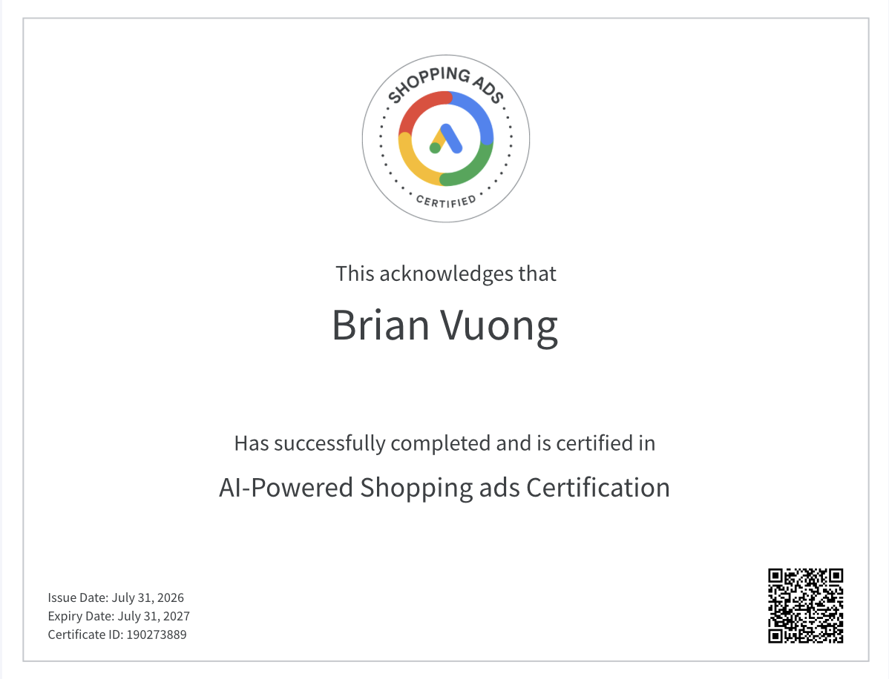

## Certification Proof

```{r, echo=FALSE, out.width="60%"}

```

## Final Application Summary

Completing the Google Shopping Ads Certification through Skillshop gave me a much clearer picture of how retail media and product-based advertising actually work behind the scenes, and it directly informs how I think about the CPP Farm Store project going forward.

**Three Most Useful Concepts**

The first concept that stood out was the structure and optimization of the product feed itself. I hadn't fully appreciated how much of Shopping Ads performance is determined before the campaign even launches — accurate titles, high-quality images, correct GTINs, and well-organized product categories all directly affect whether an ad is even eligible to show, let alone perform well. Second, I gained a much better understanding of Performance Max campaigns and how Google's automation blends Shopping, Display, Search, and YouTube inventory into a single goal-based campaign. Learning how signals like audience data and creative assets feed that automation changed how I think about campaign setup. Third, the certification clarified how measurement works in a retail context — specifically how conversion value, ROAS, and attribution windows interact to tell a more complete story than clicks or impressions alone.

**Applying This to CPP Farm Store's Omnichannel Opportunities**

The certification helped me see the Farm Store not just as a single physical location, but as a business with real omnichannel potential. A well-structured product feed could let the Farm Store advertise seasonal produce, plants, or specialty goods directly in Google Shopping results, driving both online orders and in-store visits. Concepts like local inventory ads and Performance Max's ability to blend online and offline signals showed me how a small, local retailer can compete for visibility without a massive budget, as long as the underlying data (inventory, pricing, location) is clean and consistent.

**Application to My Group Project**

I applied this knowledge directly to our group's analysis of the Shopify sales dataset. Understanding how retailers structure product data for Shopping Ads gave me a better lens for interpreting variables like product category, discount percentage, and return rate in our returns-prediction model. It helped me think about the data not just statistically, but from a retail-strategy perspective — for example, recognizing how discounting or poor product categorization (issues that matter a lot in Shopping Ads eligibility) might also correlate with higher return rates in our dataset.

**Increased Confidence**

I now feel much more confident discussing product feed optimization and Performance Max campaign structure in a professional setting. These used to be concepts I only understood abstractly, but I can now speak to how they actually function and why they matter for a retailer's visibility and ROI.

**Resume/LinkedIn Description**

On a resume or LinkedIn, I would describe this as: "Google Shopping Ads Certified — skilled in product feed optimization, retail media strategy, and Performance Max campaign management," positioned under certifications or skills to complement my existing digital marketing and design experience.

## Appendix

Published Report: https://brianvuong1.github.io/retail-marketing/shopping-ad-part-3.html 


