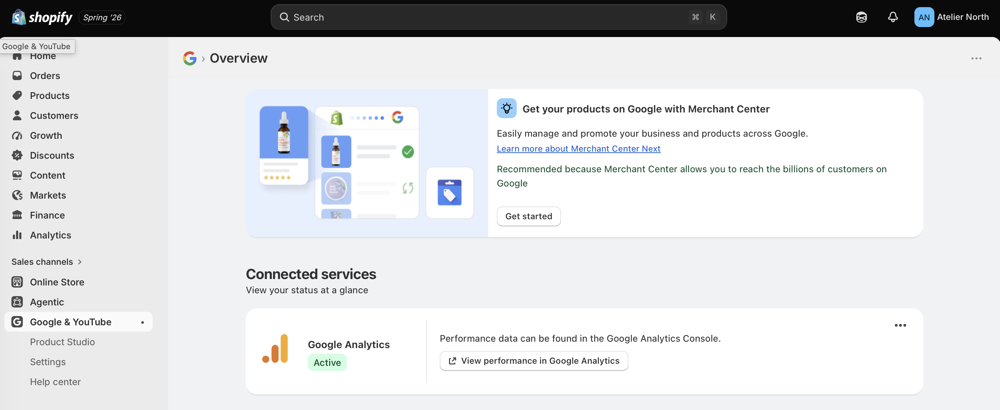
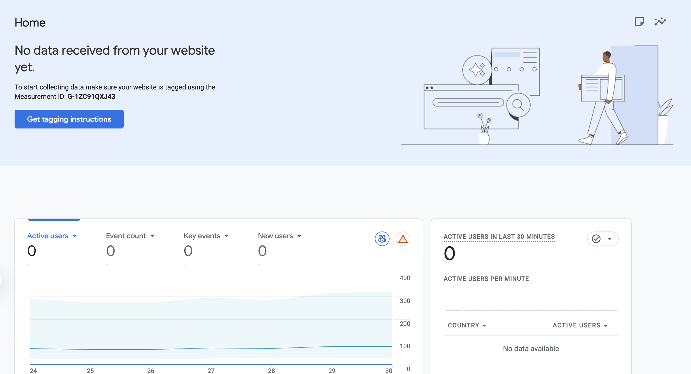

## GA4 Property / Web Stream Evidence

```{r, echo=FALSE, out.width="80%"}

```

The screenshot above shows the GA4 property and web stream created for the Shopify practice store, including the measurement ID used to connect data collection.

## Shopify Connection Evidence

```{r, echo=FALSE, out.width="80%"}

```

This screenshot documents the attempt to connect the Shopify store to GA4 via the Google & YouTube channel app, which links customer events and the GA4 measurement ID to the store's storefront.


## Technical Issue Documentation

During setup, the main challenge was confirming that the GA4 measurement ID had been correctly recognized by Shopify's Google & YouTube channel app, since Shopify does not always provide immediate visual confirmation that the connection was successful. To troubleshoot, I re-verified the measurement ID in GA4's Data Streams settings, cross-checked it against the ID entered in Shopify's sales channel settings, and used GA4's DebugView to look for incoming events.

## CPP Farm Store Analytics Reflection

With GA4 and Shopify analytics in place, CPP Farm Store could track a wide range of customer behavior that goes well beyond simple sales totals. GA4 would allow the Farm Store to see which traffic sources whether it is organic search, social media, email, or paid ads, drive visitors to the online store, and which products or categories (produce, plants, specialty goods) generate the most interest through page views and add-to-cart events. Shopify's own analytics would complement this by tracking conversion rates, cart abandonment, and repeat purchase behavior, helping the Farm Store understand not just who is visiting, but who is buying, how often, and what might be causing potential customers to leave before checkout. Together, this data could inform decisions about which products to promote, when to run seasonal campaigns, and how to better integrate the online and in-store shopping experience.

## Appendix

- GitHub Repository: https://github.com/brianvuong1/retail-marketing
- GitHub Pages (Published Report): https://brianvuong1.github.io/retail-marketing/week-9-shopify.html

